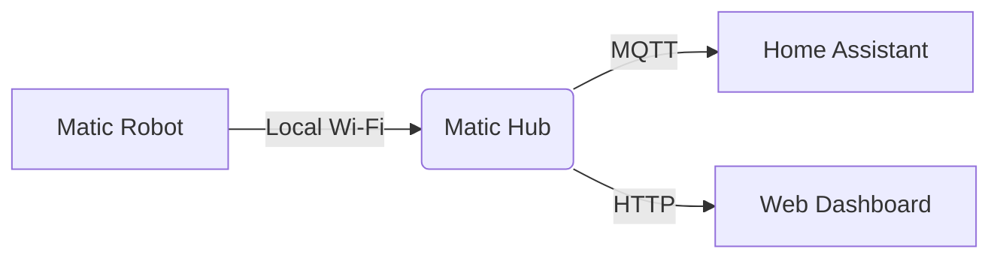

# Matic Home Hub 🏠⚡🤖

> **The missing link between Matic Robots and your Smart Home.**
> 
> 🔗 **[Live Demo](https://your-username.github.io/matic-ha-hub)** (Replace with your actual URL)

**Matic Home Hub** is a local-first, privacy-focused bridge that connects your Matic robot vacuums to Home Assistant via MQTT. It unlocks the full potential of your robot without compromising on the privacy values that Matic stands for.


## 🚀 Features

*   **🔒 100% Local & Private**: No cloud servers, no data sharing. Your map stays on your network.
*   **⚡ Zero Latency Control**: Instant response times via local WebSocket/HTTP.
*   **🔌 Universal MQTT Support**: Works out of the box with Home Assistant, OpenHAB, Node-RED, and more.
*   **🗺️ Live Map Visualization**: See where your robot is in real-time (Simulated in Demo).
*   **🔋 Detailed Stats**: Monitor battery, cleaning area, and system health.
*   **🐳 Dockerized**: One-command setup.

## 🛠️ Architecture



1.  **Discovery**: The Hub scans your network for Matic robots.
2.  **Translation**: It converts Matic's internal protocol to standard MQTT topics (e.g., `matic/robot/status`, `matic/robot/command`).
3.  **Control**: Home Assistant sends commands (`start`, `pause`, `zone_clean`) which the Hub relays to the robot.

## 🏁 Quick Start

### Prerequisites
*   Docker & Docker Compose

### Installation

1.  Clone the repository:
    ```bash
    git clone https://github.com/yourusername/matic-ha-hub.git
    cd matic-ha-hub
    ```

2.  Start the Hub:
    ```bash
    docker compose up -d
    ```

3.  Open the Dashboard:
    Go to `http://localhost:8080`

## 🔧 Configuration

Edit `matic_hub/config.py` to set your preferences:

```python
MQTT_BROKER = "mosquitto"
MQTT_PORT = 1883
SCAN_INTERVAL = 5
```

## 🤝 Contributing

We love contributions! Please see `CONTRIBUTING.md` for details.

## 📄 License

MIT License. See `LICENSE` for more information.

---

*Built with ❤️ for the Matic Community.*
